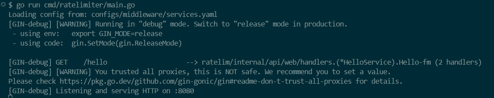
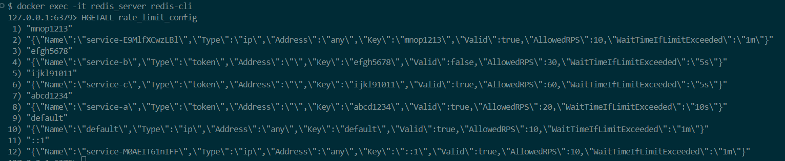
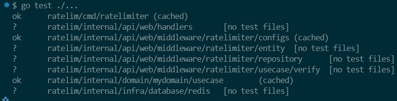

# 🚦 Rate Limiter em Golang - GoExpert Full Cycle

## 📚 Visão Geral

Este projeto foi desenvolvido como parte do desafio da pós-graduação **GoExpert** da **Faculdade Full Cycle**, com o objetivo de implementar um **Rate Limiter** robusto e configurável em **Golang**, capaz de controlar o número máximo de requisições por segundo com base em **IP** ou **Token de Acesso**.

O **Rate Limiting** é uma estratégia essencial para proteger aplicações contra abusos, sobrecargas e garantir um uso justo de recursos. Ele limita a frequência de chamadas feitas por clientes em um intervalo de tempo, promovendo estabilidade e segurança em sistemas distribuídos.

---

## ⚙️ Funcionalidades

- ✅ Limitação de requisições por **IP** ou **Token de Acesso** (prioridade para Token).
- ✅ Middleware desacoplado e fácil de integrar ao servidor HTTP.
- ✅ Configuração dinâmica via arquivo `.yaml`.
- ✅ Tempo de espera personalizável após o estouro do limite.
- ✅ Serviços ativáveis/desativáveis individualmente via flag `valid`.
- ✅ Fallback automático para o serviço **default** (obrigatório).
- ✅ Persistência e controle usando **Redis**.
- ✅ Suporte a múltiplas estratégias de armazenamento com **Strategy Pattern**.

## 🛡️ Rate Limiter Personalizado com Gin

O **Rate Limiter** implementado neste projeto atua como um middleware para o framework **Gin**, verificando se as requisições feitas a cada endpoint atendem aos limites de taxa definidos com base no **IP** ou **Token de Acesso**.

### Como Funciona

O Rate Limiter é integrado ao servidor Gin através do método `Verify()`, que é usado como middleware para garantir que as requisições passem pela verificação de rate limiting antes de acessar os endpoints.

O código do middleware pode ser encontrado em:  
`internal/api/web/handlers/rate_limiter.go`

### O que o `Verify()` faz:

- **Verifica o Token (`Api-Key`) ou o IP do cliente**.
- **Consulta a regra de rate limiting** definida para o cliente.
- **Bloqueia ou permite a requisição** com base nas configurações, retornando mensagens de erro apropriadas caso o limite seja excedido ou o serviço esteja bloqueado.

### Flexibilidade de Persistência

A lógica de verificação é construída sobre uma interface (`VerifyUsecaseInterface`), o que permite que a implementação do sistema de persistência (atualmente usando Redis) seja facilmente substituída, caso seja necessário, sem alterar a lógica central do Rate Limiter.

---

## ▶️ Como Executar

### 1. Clone o Repositório
```bash
git clone https://github.com/LuisGaravaso/goexpert-ratelimiter.git
cd goexpert-ratelimiter
```

### 2. Suba os containers com Docker
```bash
docker-compose up -d
```

### 3. Execute o Servidor
```bash
go run cmd/ratelimiter/main.go
```

Você verá um output como na imagem abaixo:




### 4. Verificando o Redis

Para verificar os padrões armazenados no Redis
```base
docker exec -it redis_server redis-cli
```
No **Redis-CLI** você pode executar `HGETALL rate_limit_config` para obter todos os serviços registados, como na imagem abaixo



---

## 📡 Requisições HTTP

Após subir o servidor, você poderá realizar requisições HTTP protegidas pelo **Rate Limiter**, que valida e controla o acesso com base no **IP de origem** ou em um **Token de Acesso** (via header `Api-Key`).

A seguir, apresentamos exemplos de requisições e os comportamentos esperados:

---

### ✅ `GET /hello` — Endpoint de Exemplo

Este endpoint serve como uma demonstração funcional do rate limiter. Ele retorna uma mensagem simples com o nome do serviço identificado.

---

### ▶️ Requisição sem Token (`Api-Key` não informado)

Quando nenhuma `Api-Key` é fornecida no header, o sistema registra o cliente como um serviço com nome dinâmico no formato `service-{12 caracteres aleatórios}` e aplica **as configurações do serviço `default`**.

```bash
curl -X GET http://localhost:8080/hello
```

#### 📥 Resposta esperada:
```json
{
  "message": "Hello, service-KsueTgbqApZw"
}
```

---

### ▶️ Requisição com Token via header `Api-Key`

```bash
curl -X GET http://localhost:8080/hello \
  -H "Api-Key: abcd1234"
```

#### 📥 Resposta esperada:
```json
{
  "message": "Hello, service-a"
}
```

---

### ⛔ Quando o limite de requisições é excedido

Se o número de requisições ultrapassar o `allowed_rps` configurado, a aplicação retorna **HTTP 429 - Too Many Requests**, com uma mensagem detalhada informando o nome do serviço, o limite permitido e o horário de liberação do bloqueio:

Para testar, execute os requests em loop:
```bash
seq 1 25 | xargs -n 1 -P 25 -I {} bash -c '
  if [ {} -eq 1 ]; then
    echo "First Request: $(curl -s -X GET http://localhost:8080/hello -H "Api-Key: abcd1234")"
  elif [ {} -eq 25 ]; then
    echo "Last Request: $(curl -s -X GET http://localhost:8080/hello -H "Api-Key: abcd1234")"
  else
    curl -s -X GET http://localhost:8080/hello -H "Api-Key: abcd1234" > /dev/null
  fi
'
```

**Como Output você verá:**

```json
First Request: {"message":"Hello, service-a"}
Last Request: {"message":"Rate limit excedido para o serviço 'service-a': 20 requisições permitidas por segundo. Bloqueado até 15:47:00."}
```

---

### 🚫 Quando o serviço está desativado (`valid: false`)

Se um serviço estiver com `valid: false` no `services.yaml`, mesmo com token correto, ele será tratado como bloqueado.

**Exemplo**
```bash
curl -X GET http://localhost:8080/hello \
  -H "Api-Key: efgh5678"
```

A aplicação retorna **HTTP 403 - Forbidden** com a seguinte resposta:

```json
{
  "message": "Serviço bloqueado"
}
```

---

### ⚠️ Quando ocorre um erro interno no sistema

Se ocorrer algum erro interno ao buscar a configuração do serviço (ex: erro de leitura do arquivo YAML ou falha no Redis), a aplicação retorna **HTTP 500 - Internal Server Error** com a mensagem:

```json
{
  "message": "Erro ao buscar configuração de rate limit"
}
```

---

> 💡 **Importante:** Todo o controle de requisições é aplicado por um middleware antes da execução do handler. O Rate Limiter atua de forma transparente e garante proteção à aplicação com alta performance e flexibilidade de configuração.


---

## 🛠️ Configuração do Ambiente

### 1. Variáveis de Ambiente
Crie um arquivo `.env` com o seguinte conteúdo:
```env
REDIS_ADDR=localhost:6379
REDIS_PASSWORD=
REDIS_DB=0
RATE_LIMIT_CONFIG_PATH=configs/middleware/services.yaml
```

### 2. Docker Compose (Redis)
```yaml
version: '3.8'

services:
  redis:
    image: redis:7.4.2-alpine
    container_name: redis_server
    ports:
      - "6379:6379"
    volumes:
      - redis_data:/data
    restart: always

volumes:
  redis_data:
```

### 3. Arquivo de Configuração dos Serviços (`services.yaml`)

O arquivo `services.yaml` define as regras de rate limit para cada serviço que acessará a aplicação. Ele é estruturado como uma lista de serviços, cada um com suas próprias configurações.

#### 🔸 Regras Gerais:

- ✅ **Serviço `default` é obrigatório**:  
  Ele funciona como um fallback. Sempre que um IP ou Token **não estiver listado explicitamente**, as requisições seguirão as regras do serviço `default`. Isso evita bloqueios totais e impede permissividade excessiva em casos não mapeados.

- ✅ **Parâmetro `valid`**:  
  Permite ativar (`true`) ou **bloquear (`false`)** temporariamente um serviço sem removê-lo do arquivo.

- ✅ **Parâmetro `type`**:
  - `ip`: A limitação será feita com base no endereço IP de origem.
  - `token`: A limitação será feita com base em um Token de Acesso fornecido no cabeçalho da requisição.
  
- ✅ **Chaves obrigatórias por tipo**:
  - `type: ip` → Requer o campo `address`.
  - `type: token` → Requer o campo `key`.

- ✅ **Parâmetros opcionais**:
  - `allowed_rps`: Quantidade máxima de requisições por segundo.
  - `wait_time_if_limit_exceeded`: Tempo de espera antes de liberar novas requisições após o limite ser excedido.
  
  Caso esses dois parâmetros não sejam fornecidos, **os valores do serviço `default` serão utilizados como padrão**.

#### 📝 Exemplo completo:

```yaml
services:
  - name: default
    type: ip
    address: any
    valid: true
    allowed_rps: 10
    wait_time_if_limit_exceeded: "1m"

  - name: service-a
    type: token
    key: "abcd1234"
    valid: true
    allowed_rps: 20
    wait_time_if_limit_exceeded: "10s"

  - name: service-b
    type: token
    key: "efgh5678"
    valid: false

  - name: service-c
    type: token
    key: "ijkl91011"
    valid: true
    allowed_rps: 60
    wait_time_if_limit_exceeded: "5s"
```

> 💡 **Dica:** Quando `allowed_rps` e `wait_time_if_limit_exceeded` não forem informados em um serviço específico, **o sistema automaticamente herdará os valores do `default`**, garantindo consistência no comportamento do Rate Limiter.

---

## 🧪 Testes Automatizados

Os testes são implementados com a biblioteca `testify` e podem ser executados com o comando:

```bash
go test ./...
```

Você deve ver um resultado como



#### Teste E2E do Rate Limiter

O teste **`TestRateLimiter_SimpleSequential`** é o principal desse repositório e executa **50 requisições** para o endpoint `/hello`, variando o **header** da requisição conforme os diferentes serviços configurados no `services.yaml`. O objetivo é verificar os **status das primeiras e últimas requisições** para cada serviço, garantindo que as regras de rate limiting sejam aplicadas corretamente.

O que o teste faz:

- Para **cada serviço configurado**, ele envia **50 requisições**.
- **Primeira requisição**: Armazena o **status** da primeira requisição.
- **Última requisição**: Armazena o **status** da última requisição.
- **Verifica se os resultados estão corretos**, de acordo com as configurações de rate limit, bloqueio e serviço desconhecido.

Resultados Esperados:

- **Primeira requisição**: Retorno `200 OK` para serviços **não bloqueados**.
- **Última requisição**: Retorno `429 Too Many Requests` para serviços que excederam o limite ou `403 Forbidden` para serviços **bloqueados**.

---

## 🔧 Tecnologias Utilizadas

- [Golang](https://golang.org)
- [Redis v9](https://redis.io)
- [Gin Gonic](https://gin-gonic.com)
- [godotenv](https://github.com/joho/godotenv)
- [Viper](https://github.com/spf13/viper)
- [Testify](https://github.com/stretchr/testify)
- [Docker](https://www.docker.com)
- [Docker Compose](https://docs.docker.com/compose/)

---

## 📁 Estrutura do Projeto

```
├── cmd/ratelimiter                # Entrada principal da aplicação
│   ├── .env                       # Configurações do ambiente
│   ├── main.go                    # Inicialização do servidor
│   └── main_test.go               # Testes de alto nível
├── configs/middleware
│   └── services.yaml              # Configuração dos serviços com rate limit
├── internal
│   ├── api/web/handlers           # Handlers HTTP
│   ├── middleware/ratelimiter     # Lógica central do rate limiter
│   │   ├── configs                # Parsing do arquivo YAML
│   │   ├── entity                 # Definições de entidades
│   │   ├── repository             # Interface de persistência
│   │   └── usecase                # Regras de negócio
│   └── domain/mydomain/usecase    # Casos de uso do domínio (exemplo)
├── infra/database/redis           # Implementação da camada Redis
```

### ℹ️ Observação sobre o diretório `domain/mydomain/usecase`

O repositório inclui um diretório de exemplo em:

```
internal/domain/mydomain/usecase
```

Este diretório contém **um exemplo simples de caso de uso**, onde a aplicação retorna um **Hello** para o serviço que está fazendo a requisição.

> 🔧 **Nota:** Essa estrutura foi adicionada **apenas como sugestão de organização** e pode ser livremente adaptada, removida ou expandida conforme as necessidades do seu projeto.
